<h1 align="center">
  Line Robot Hack Starter :racing_car:
</h1>

> [!IMPORTANT]
> This project has been built for use in $\color{BrickRed}{Hackathons}$ and $\color{BrickRed}{Demos}$ - use this code with discretion - it is not designed with production usage in mind.

## Getting Started

Woohoo - it's time to build a line robot :woman_technologist: :man_technologist:

You should have been given a box of goodies - inside you should have the following:


| Item | Image |
|------|-------|
| 1 x Innovation Hub Robot Chassis |  |
| 1 x Innovation Hub Robot Development Board (v1.1) | 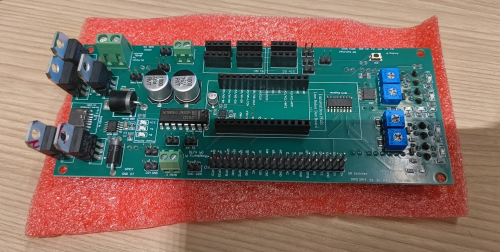 |
| 1 x Arduino MKR 1010 | 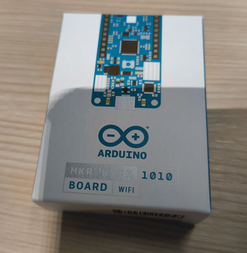 |
| 2 x TT Geared DC Motors | 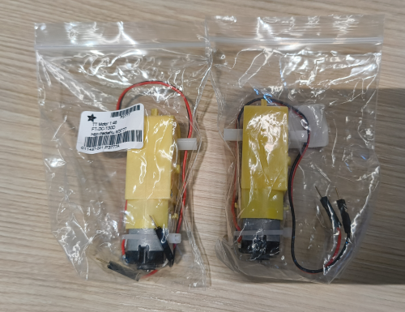 |
| 1 x RGB Sensor | 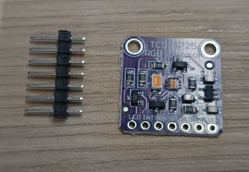 |
| 1 x Micro OLED Screen | 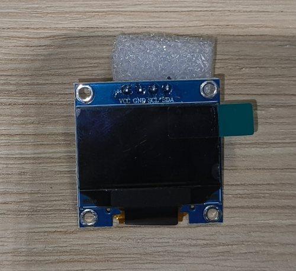 |
| 1 x Ultrasonic Sensor | 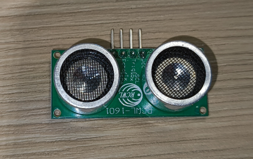 |
| 1 x 14v Battery | 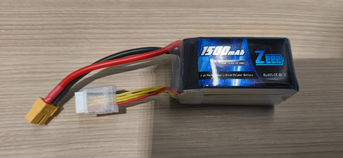 |
| 2 x Battery Connectors | 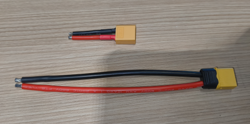 |
| 1 x Micro-USB Cable | 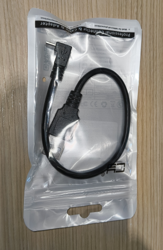 |
| 2 x Basic Wheels | 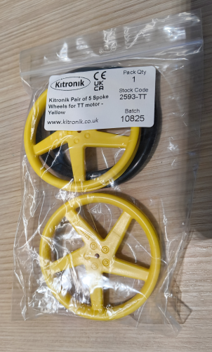 |
| 1 x Ball-bearing Wheel | 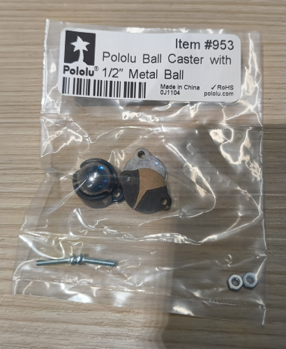 |
| 1 x Button | 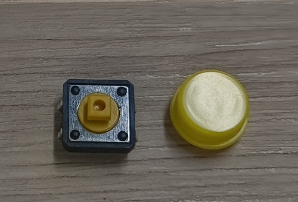 |
| 1 x Small Breadboard | 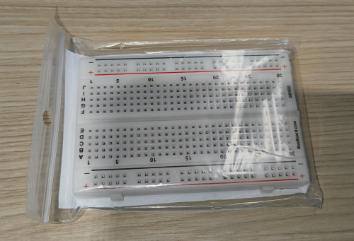 |
| A bunch of Dupont Wires | 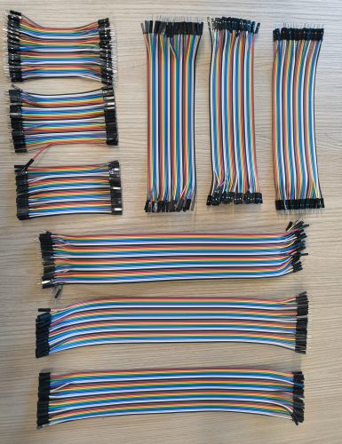 |
| A Set of Tools | 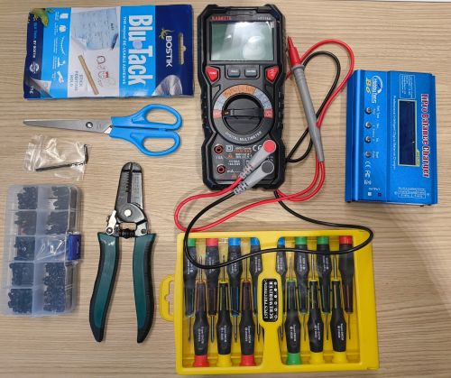 |


If you're missing anything, find one of the Innovation Hub Team.

Before you can start hacking you will need to get your computer setup for developing with the Arduino.

### Setting up the Arduino IDE

Head over to the [Arduino Software](https://www.arduino.cc/en/software) site, then download + install the latest Arduino IDE.

Whilst the IDE is installing, head over to where you cloned this repo and rename the `arduino_secrets_template.h` file to `arduino_secrets.h`.
Then, open the file and update the WIFI password (if you don't know the password, just ask one of the Hub team).

Once the IDE has finished installing, launch it and then goto File -> Open, browse to this project and select the `line-robot.ino` file.

> You will need to let the IDE know which board you're working with. You csn do this by selecting the board from the drop down list near the top of the IDE and select **Arduino MKR Wifi**. You may also be prompted to install multiple drivers.

This should open up the Line Robot Sketch and you should see 3 files: 

* `line-robot.ino` - The main sketch file - this is where you will be hacking :)
* `arduino_secrets.h` - This is the file where you set the WIFI SSID + Password
* `README.md` - That's this file ;p

Next, we need to install the Arduino WiFi library - this can be done using the IDE.
Open the "Library Manager" (the little Books icon on the left side), and then search for "WiFiNINA", select and install it.

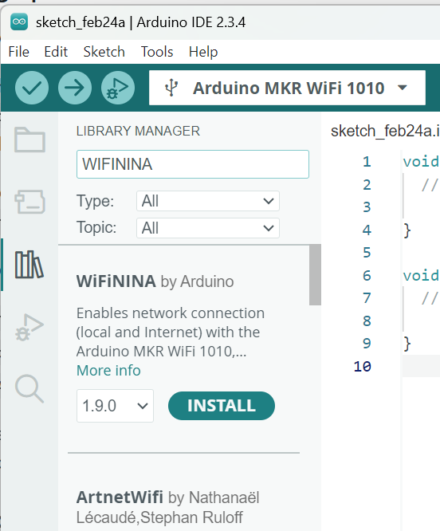


### Setting up the Development Board

In your box will be a small PCB that looks something like this: 

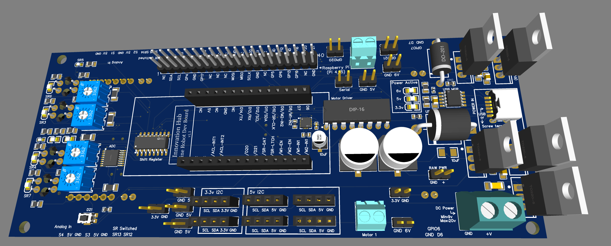

Take the Arduino out of its packaging and carefully insert it into female headers in the middle of the PCB, being sure to orient it correctly (the micro-USB connection of the Arduino should be towards the **front** of the board [where the Blue potentiometers are]).

Make sure the Arduino has been pushed most of the way into the headers and make sure that you have oriented it correctly (if it's in backwards you may damage both the Arduino and the board when the power comes on).

Next, grab some dupont wires and connect the Micro OLED to the **3.3v** I2C pins on the side (be careful to get the pins correctly matched to the pins on the OLED display).

Next, head over to the hardware table, grab a screwdriver and a wire stripper. 
You want to strip the ends of the DC Motor wires, and then connect them to the two Motor screw terminals on the sides of the board (don't connect them to the power terminal at the back of the board).

Whilst it doesn't matter too how you orient the wires in the terminals, We recommend putting the red wire towards the front of the board on the Motor 2 terminal (right hand side), and the towards the back of the board on the Motor 1 terminal (left hand side).

Next, we need some power for the board, let's not waste the battery for now, so, connect a usb-c cable to the back of the development board (be sure to use a charger that supports a 15v or 20v USB connection. For our purposes there is a laptop-grade battery pack provided).

Hopefully you should see some lights on the board come on :)

Now, we can connect the arduino to your computer using the Micro-USB cable. Check the angles. Smaller side of the port is at the bottom. 

Head back to the Arduino IDE and you should now be able to see the Arduino is connected in your IDE.

One more thing to be aware of - the power regulators at the back of the board (with the large heatsinks that stick up) get **very** hot - be careful not to burn yourself when handling the board whilst the power is on!

OK - that that you've done all this, you're ready to start hacking!! :man_dancing:

## If this works, you're ready to code

Compile and upload the `line-robot.ino` file to the Arduino.

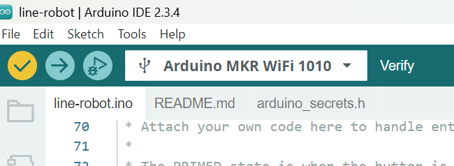

Press the Main Board Button (see yellow circle on the image) down till the screen says PRIMED and then press it again. The wheels should turn for a couple of seconds.

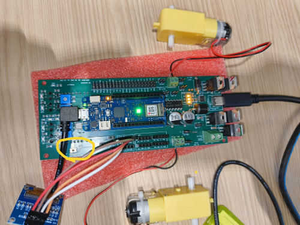

When the board is not doing anything, the OLED display should show IDLE.

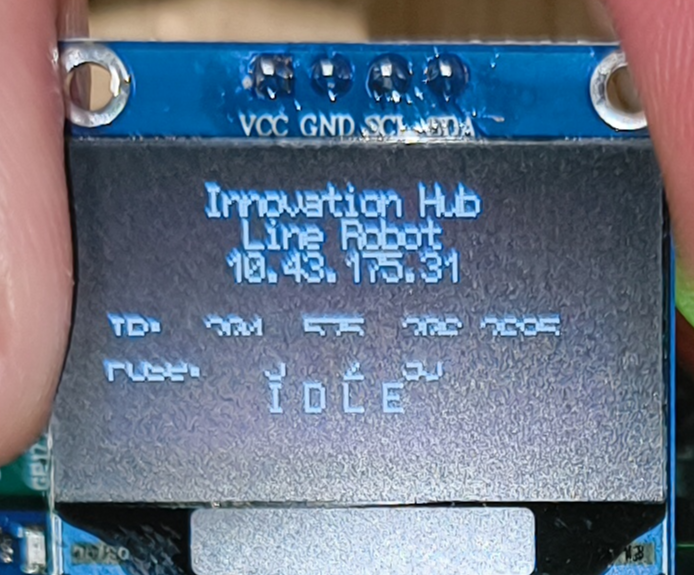

If you want to use the larger buttons from your kit instead, then connect the button to pins **A6 and GND** on the main board headers to mimic the main board button.


## Baseline Acquisition

**IMPORTANT** Its important for the robot to understand what the floor looks like in general. In order to get a baseline of these numbers, you need to baseline the robot (after every power-cycle or reset).

To start the baseline process, do one of the following:  (When in IDLE mode)
* Hold the robot **vertically** and press the Board Button
* **double press** Board Button
* Using the HTTP server, call the `/btn-double-press` route (aka `curl http://<ipaddress>/btn-double-press`)

Once you enter baselining mode, place the car on the floor (and off the track), then press the button to run the baseline process (this will take a few seconds).

Once done, the robot will return to the IDLE state.

## Code Overview

Have a look at the `line-robot.ino` file, this is where you can build all the code you'll need for your robot.

If you're feeling brave, feel free to build your own c++ code on the side - any files you drop into this folder (including `.h` and `.cpp`) will be visible in the Arduino IDE - any `.h` + `.cpp` files you drop in here will be compiled alongside your Arduino sketch.

Arduino Sketch files have two required functions: 

* `void setup() { }` - This will be called *once* when the board is powered on (or after a reset) - put all your setup + initialisation code in this function
* `void loop() { }` - This will be called *repeatedly* (think of it being like your standard game loop) - your logic goes here

The rest of the code in the sketch file is just functions referenced from one of these two functions.

### Development Board Code

You will notice at the top of the sketch this include statement:  `#include "src/hub-line-robot-base.h"`

This brings in the base code for working with the Line Robot Development Board.
Don't worry, there's no magic in there (probably just lots of bugs ;p) - it's there to make it easier for you to get up and running quickly with the hardware, and let's you get straight into hacking rather than monkeying around with getting everything setup talking to hardware on the dev board.

This library exposes a few utility functions and two key classes: 

* **RobotState** - A class that holds the basic state of the robot
* **RobotBoard** - A class that interacts with the hardware of the robot (Motors, Sensors, etc)

You can subclass these to add additional functionality - we recommend possibly subclassing the RobotState class, to add more state properties and to control the state however you wish to.

Out of the box, the `RobotState` class defines 3 "Drive States" that the robot can be in: 
* **IDLE** - When the robot is not doing anything
* **PRIMED** - When the robot is ready to start driving (if you loooong press - for longer than 1.2s - the button on the board, it will enter the PRIMED state
* **DRIVING** - When the robot is driving (pressing the button when in the PRIMED state will transition the robot to this state))

The out of the box sketch provides an example custom state called `MyRobotState`, defined near the top of the file. Feel free to use this state or to remove it and create your own :)

### Setup Function

Scroll down until you see the `setup` function in the sketch, this is where it creates the state object `MyRobotState`: 

```c++
state = new MyRobotState();
```

Note: This line is setting the state into the `state` global variable, one of 3 global variables defined in the Sketch:

```c++
static const long start_millis = millis();
RobotBoard* board = nullptr;
MyRobotState* state = nullptr;
```

The base state class offers a mechanism to provide a callback function that should be invoked on certain state transitions, eg. when transitioning out of the IDLE state.

You will see that we've added some default callback functions: 
```c++
  state->setOnIdleStart(onIdleBegin);
  state->setOnPrimedStart(onPrimedBegin);
  state->setOnDrivingStart(onDrivingBegin);
  state->setOnDrivingEnd(onDrivingEnd);
```

Next, it creates + initialises the `RobotBoard` class (passing the state to the board): 

```c++
  board = new RobotBoard();
  board->initBoardV1_1(state, 0x19, 0x17, true, OLED_TYPE_SSD1306);  // 0x19 for the Accelerometer, 0x17 for ADC, true for WiFi connection, OLED_TYPE_SSD1306 for the OLED display
```

We're using a `v1.1` development board, so be sure to call the `initBoardV1_1` function.


In the rest of the setup function, we also do the following: 

* Add an example HTTP Route Handler - See [HTTP Server](#http-server) below for more info on configuring routes
* Display the addresses of all the connected I2C devices
* Trigger the `onIdleBegin()` function

Feel free to add any other initialisation logic you want to this function.

## Loop Function

The loop function is the main loop for the robot - this function is akin to your typical game loop - it will be called repeatedly whilst the robot is powered on.

This is where you're logic should go (or be called from).

The one key thing you must do in the loop function is call `board->tick()` - this will give the board code a chance to update its internals (like read the values of the IR array etc...).

Otherwise, you're free to do what you want.

In the out of the box code, it simply checks the current state, and calls a function that implements the logic for that state (eg. What to do when IDLE or what to do when DRIVING...)

Just remember, the faster your loop runs, the faster your robot can react to changes in its environment.


## HTTP Server 

Assuming a successful connection to the WiFi network, the `RobotBoard` will launch an HTTP Server (on port `80`). 

This enables you to implement functionality that can be invoked via an HTTP call (eg. Query state, execute a command, etc...).

There are a few default routes that have been implemented already (listed in the root path of the webserver - aka. browse to: http://<ipaddress>/).

To implement custom functionality, you add handlers that listen on a specific path (that is everything after the hostname and upto the '?' in the path).

Here's a Hello World handler: 
```c++
HttpResponse myHandler(WiFiClient* client, HttpRequest req) {
  HttpResponse resp = HttpResponse();
  resp.status = 200;
  resp.body = "Hello World!";
  resp.headers["Content-Type"] = "text/plain";
  return resp;
}
```

If you look back at the `setup` function, you will see an example custom handler that looks like this: 

```c++
  board->addHttpHandler("/set-traffic-light", [](WiFiClient* client, HttpRequest req) {
    std::string msg = "Set Traffic Lights to: \n";
    bool red = false, yellow = false, green = false;
    if (req.query.find("red") != req.query.end()) {
      red = req.query["red"] == "true";
      msg += " -    RED: ";
      msg += (red ? "ON" : "OFF");
      msg += "\n";
    }
    
    if (req.query.find("yellow") != req.query.end()) {
      yellow = req.query["yellow"] == "true";
      msg += " - YELLOW: ";
      msg += (yellow ? "ON" : "OFF");
      msg += "\n";
    } else if (req.query.find("orange") != req.query.end()) {
      yellow = req.query["yellow"] == "true";
      msg += " - ORANGE: ";
      msg += (yellow ? "ON" : "OFF");
      msg += "\n";
    }
    
    if (req.query.find("green") != req.query.end()) {
      green = req.query["green"] == "true";
      msg += " -  GREEN: ";
      msg += (green ? "ON" : "OFF");
      msg += "\n";
    }
    board->setTrafficLight(red, yellow, green);

    HttpResponse resp = HttpResponse();
    resp.status = 200;
    resp.body = String(msg.c_str());
    resp.headers["Content-Type"] = "text/plain";
    return resp;
  });
```

This handler simply sets the state of the Traffic Light LEDs at the front of the board (There's a Red, Yellow + Green LED).

Feel free to add your own handlers to implement custom logic.

However, keep in mind we've implemented a very basic HTTP server, we support upto only 4 concurrent clients, and do not support any complex HTTP semantics - aka. keep it simple, this is not an NGINX server ;p


### Other stuff

The Arduino IDE supports intellisense, so to if you want to see the available functions on the `board`, simply type `board->` and press `CTRL+Spacebar` to bring up the list of functions: 

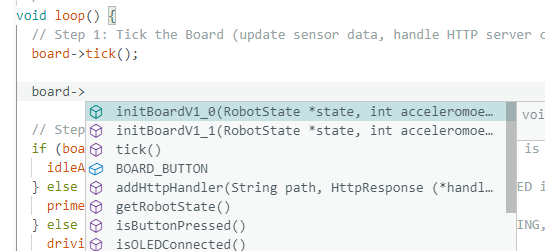

There's also plenty of comments dotted throughout the sketch, and if you hover over any function, you should see the documentation for it: 

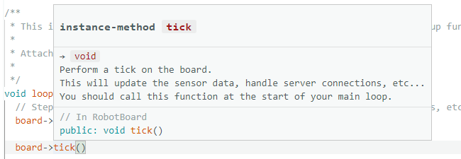

If at any time you get stuck, just reach out to the Hub team - we're here to help :)


## Start Hacking

Ok - what are you waiting for - go and hack!!
